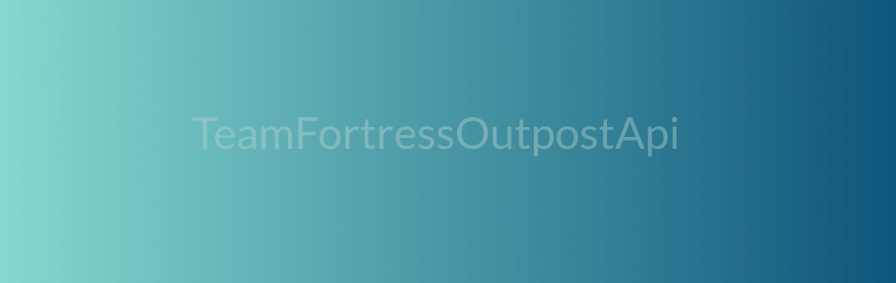

# TF2Outpost-API

  

Some classes to get access to tf2outpost.
If you want some examples of the Chapters below this go to program.cs.
If you want to contact me:

Make sure your profile is not private.

## Contact

  
